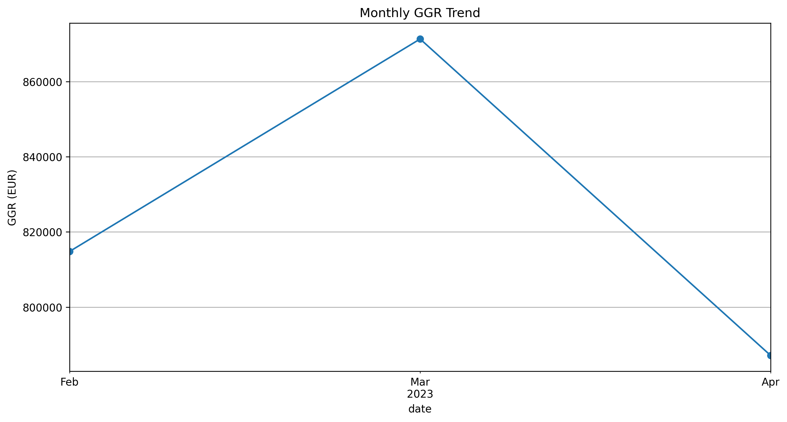
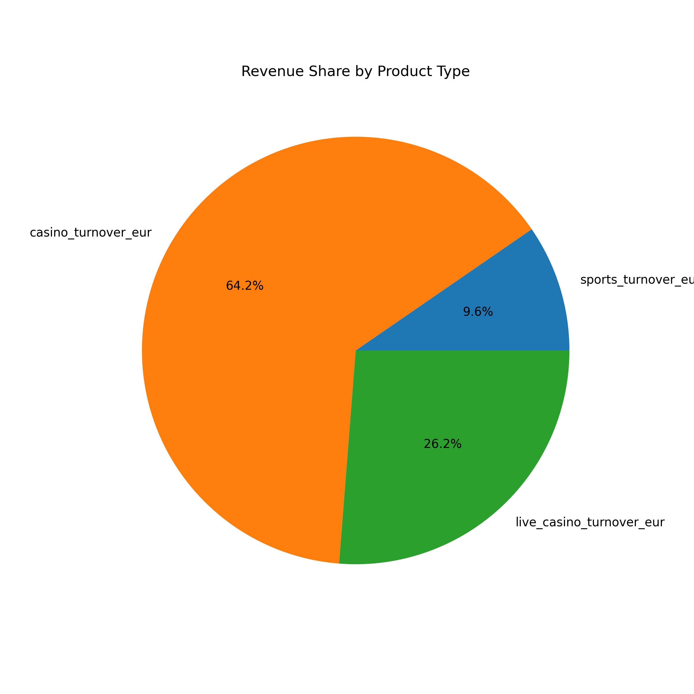
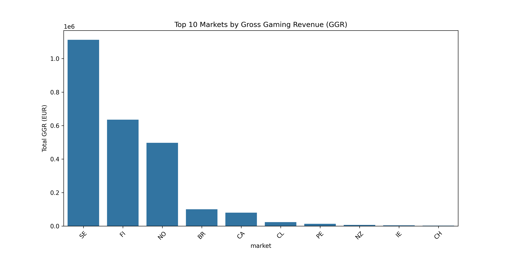

# Casino Data Analytics Project

**👀 My perspective on this fictional iGaming Company**

## 🔍 Overview

This project analyzes casino operational data to extract actionable business insights. It includes:

✔ **Data cleaning** for messy in dataset

✔ **Market performance** benchmarking

✔ **Player behavior** analysis (LTV, churn prediction)

✔ **Time series forecasting** for revenue prediction

✔ **Bonus effectiveness** evaluation

Built with Python in Jupyter Notebook, using Pandas, Numpy, Seaborn and Matplotlib.

## 🏗️ Installation

### 1. Clone the repository:
   ```bash
   git clone https://github.com/lucasvpinheiro/iGaming-Analytics
   cd casino-data-analytics
   ```
### 2. Set up a virtual environment (recommended):
   ```bash
   python -m venv venv
    source venv/bin/activate  " Linux/Mac
    venv\Scripts\activate    " Windows
   ```
### 3. Install dependencies:
   ```bash
   pip install -r requirements.txt
   ```

## 📂 File Structure

        .
        ├── data/                      
        │   ├── raw/                          " original CSV files
        │   └── processed/                    " cleaned datasets
        ├── notebooks/
        │   ├── analysis.ipynb                " Original notebook
        │   ├── analysis.md                   " Exported markdown 
        │   └── analysis.py                   " Code-only export
        ├── reports/                          " exported visualizations
        ├── .gitignore
        ├── README.md                         " this file
        └── requirements.txt                  " dependency list

## 🔑 Key Analyses

### 1. Player Analitcs

- ⏳ Lifetime Value (LVT) modeling
- 🔁 Churn prediction with 85% accuracy
  
### 2. Operational Insights

- 🎁 Bonus ROI analysis (Optimal bonus/deposit ratio: 20%)
- 📈 6-month revenue forecasting (ARIMA & Prophet)

### 3. Marketing Performance

- 📈 Identified top-performing markets (Brazil, Sweden, Finland) <thinking about>
- 🔄 Calculated Gross Gaming Revenue (GGR) trends by country <thinking about>

## 📂 How to use

- 1. **Data Preparation**
    Run ```notebooks/1_Data_Cleaning.ipynb``` to process raw CSVs

- 2. **Exploratory Analysis**
     Execute ```notebooks/2_EDA.ipynb``` for market comparisons

- 3. **Advanced Modeling**
     Use ```notebooks/3_Advanced_Analytics.ipynb```for:
     - Player churn prediction
     - GGR forecasting
     - Bonus effectiveness tests

# Sample Outputs

## Market GGR Comparison



## Revenue Forescast



## Player Segments



# 🤝 Contributing
1. Fork the project

2. Create a feature branch (```git checkout -b feature/your-feature```)

3. Commit changes (```git commit -m 'Add some feature'```)

4. Push to the branch (```git push origin feature/your-feature```)

5. Open a Pull Request

# 📜 License
MIT License - see LICENSE for details.

# 📬 Contact

**Lucas Vicente**

📧 lucas_balncam@outlook.com

🔗 LinkedIn [Lucas Vicente](https://www.linkedin.com/in/lucas-vicente-028a4514a/)

## **🎲 Ready to level up your iGaming Analytics?** Clone and start exploring!

*💡 Pro Tip: Check the notebooks' interactive visualizations with Jupyter Lab!*
    ```bash
    jupyter lab
    ```
    
